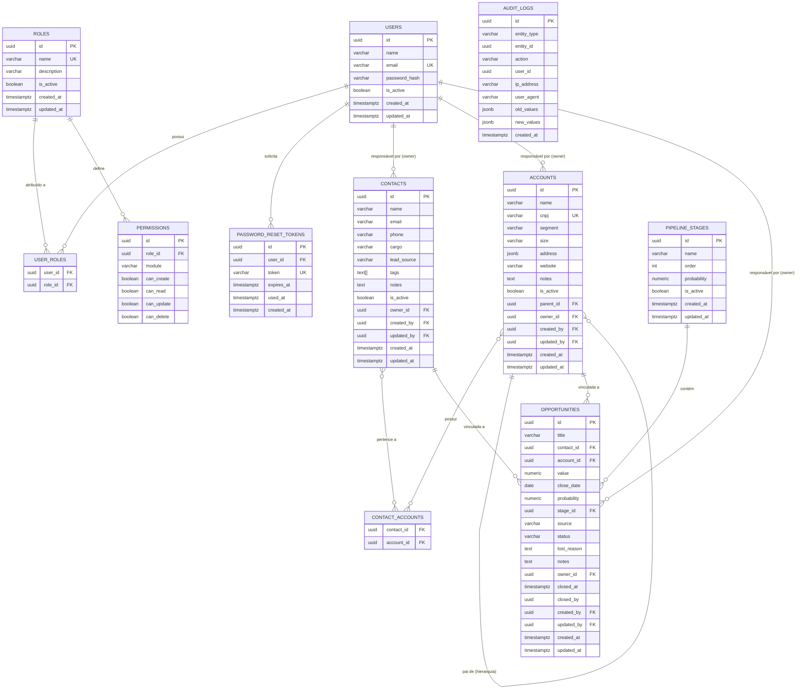

# CRM Backend

Backend de CRM desenvolvido como monolito orientado a dominios, com estrutura preparada para migracao incremental a microservicos.

Stack: Python 3.12, FastAPI, PostgreSQL 16, SQLAlchemy 2 async, Alembic, Docker e uv.

---

## Indice

- [Visao Geral](#visao-geral)
- [Arquitetura](#arquitetura)
- [Modulos Implementados](#modulos-implementados)
- [Quick Start](#quick-start)
- [Desenvolvimento Local](#desenvolvimento-local)
- [Variaveis de Ambiente](#variaveis-de-ambiente)
- [API e Documentacao](#api-e-documentacao)
- [Banco de Dados](#banco-de-dados)
- [Estrutura do Projeto](#estrutura-do-projeto)
- [Credenciais Padrao](#credenciais-padrao)
- [Roadmap](#roadmap)

---

## Visao Geral

O sistema cobre o fluxo comercial principal com autenticacao e RBAC, gestao de contatos e contas, pipeline de oportunidades, atividades operacionais, relatorios e auditoria.

No estado atual, a Fase 1 esta implementada e a Fase 2 esta parcialmente entregue, com Atividades, Relatorios e a administracao de estagios do funil funcionando. O item ADM-002, de campos personalizados, ainda nao esta concluido.

---

## Arquitetura

```text
app/
|-- core/          <- Infraestrutura transversal: config, banco, JWT, deps
|-- shared/        <- Utilitarios compartilhados
`-- modules/
    |-- auth/          <- Autenticacao e controle de acesso
    |-- contacts/      <- Contatos
    |-- accounts/      <- Contas
    |-- activities/    <- Atividades, tarefas e follow-ups
    |-- opportunities/ <- Oportunidades e pipeline
    |-- reports/       <- Dashboards e exportacoes
    `-- audit/         <- Auditoria
```

Cada modulo segue a estrutura `models.py`, `schemas.py`, `service.py` e `router.py`.

---

## Modulos Implementados

| Modulo | Historias | Endpoints principais |
|---|---|---|
| Autenticacao (AUT) | AUT-001, AUT-002, AUT-003 | `/auth/*`, `/admin/users`, `/admin/roles` |
| Contatos (CON) | CON-001, CON-002, CON-003 | `/contacts` |
| Contas (ACC) | ACC-001, ACC-002 | `/accounts`, `/accounts/{id}/hierarchy` |
| Atividades (ACT) | ACT-001, ACT-002 | `/activity-types`, `/activities` |
| Oportunidades (OPP) | OPP-001 a OPP-004 | `/opportunities`, `/pipeline`, `/pipeline/stages` |
| Relatorios (REP) | REP-001 a REP-003 | `/reports/sales-dashboard`, `/reports/pipeline`, `/reports/activities` |
| Auditoria (NFR) | NFR-003 | `/audit` |

### Status da Fase 2

| Tema | Status |
|---|---|
| Atividades (ACT-001, ACT-002) | Implementado |
| Relatorios (REP-001 a REP-003) | Implementado |
| Administracao de estagios (ADM-001) | Implementado em `/pipeline/stages` |
| Campos personalizados (ADM-002) | Ainda nao concluido |

### Validacao atual

Os artefatos operacionais da Fase 2 foram validados com:

```bash
.venv\Scripts\python.exe -m pytest tests/test_activities.py tests/test_reports.py tests/test_opportunities.py -q
```

Resultado mais recente: `55 passed`.

---

## Quick Start

```bash
git clone <repo-url>
cd CRM-Monolito-Micro_service
cp .env.example .env
docker compose up --build
```

API: `http://localhost:8000/api/v1/docs`

---

## Desenvolvimento Local

### Servicos em desenvolvimento

| Servico | URL | Descricao |
|---|---|---|
| API | `http://localhost:8000` | FastAPI com hot reload |
| Swagger UI | `http://localhost:8000/api/v1/docs` | Documentacao interativa |
| ReDoc | `http://localhost:8000/api/v1/redoc` | Documentacao alternativa |
| Postman Collection | `http://localhost:8000/api/v1/postman-collection.json` | Collection gerada a partir do OpenAPI |
| pgAdmin | `http://localhost:5050` | Interface web do PostgreSQL |
| Mailpit | `http://localhost:8025` | Inspecao de emails SMTP em desenvolvimento |
| PostgreSQL | `localhost:5432` | Conexao direta ao banco |

### Comandos uteis

```bash
docker compose up --build
docker compose up -d
docker compose logs -f app
docker compose down
docker compose down -v
```

### Migracoes

```bash
docker compose exec app alembic upgrade head
docker compose exec app alembic revision --autogenerate -m "descricao"
docker compose exec app alembic downgrade -1
docker compose exec app alembic history --verbose
```

### Dependencias com uv

```bash
uv sync --extra dev
uv add <pacote>
uv add --dev <pacote>
uv lock --upgrade
```

### Testes

```bash
docker compose exec app uv run pytest -v
uv run pytest -v
uv run pytest --cov=app --cov-report=html
```

### Rodar sem Docker

```bash
uv sync
uv run alembic upgrade head
uv run uvicorn app.main:app --reload --port 8000
```

---

## Variaveis de Ambiente

O projeto usa `.env` e carrega as configuracoes via `pydantic-settings`.

| Variavel | Descricao |
|---|---|
| `SECRET_KEY` | Chave de assinatura do JWT |
| `ALGORITHM` | Algoritmo JWT |
| `ACCESS_TOKEN_EXPIRE_MINUTES` | Duracao do access token |
| `REFRESH_TOKEN_EXPIRE_DAYS` | Duracao do refresh token |
| `POSTGRES_HOST` | Host do PostgreSQL |
| `POSTGRES_PORT` | Porta do PostgreSQL |
| `POSTGRES_DB` | Nome do banco |
| `POSTGRES_USER` | Usuario do banco |
| `POSTGRES_PASSWORD` | Senha do banco |
| `CORS_ORIGINS` | Origens permitidas |
| `DEBUG` | Habilita logs e detalhes extras |
| `SESSION_INACTIVITY_MINUTES` | Tempo de inatividade da sessao |
| `PASSWORD_RESET_RATE_LIMIT_MINUTES` | Janela do reset de senha |
| `AUDIT_LOG_RETENTION_DAYS` | Retencao de logs de auditoria |

Observacao: o fluxo de recuperacao de senha agora envia email via SMTP. Em desenvolvimento, o Mailpit pode ser usado para inspecao das mensagens e o endpoint continua retornando `dev_token` fora de producao para facilitar testes locais.

---

## API e Documentacao

### Autenticacao

O login segue o formato `OAuth2PasswordRequestForm`:

```bash
curl -X POST http://localhost:8000/api/v1/auth/login \
  -F "username=admin@gmail.com" \
  -F "password=Coto1423"
```

Refresh:

```bash
curl -X POST http://localhost:8000/api/v1/auth/refresh \
  -H "Content-Type: application/json" \
  -d '{"refresh_token":"<refresh_token>"}'
```

Download da collection do Postman:

```bash
curl -OJ http://localhost:8000/api/v1/postman-collection.json
```

### Mapa de endpoints

```text
Autenticacao
  POST  /api/v1/auth/login
  POST  /api/v1/auth/refresh
  POST  /api/v1/auth/forgot-password
  POST  /api/v1/auth/reset-password
  GET   /api/v1/auth/me
  POST  /api/v1/auth/change-password

Usuarios
  GET    /api/v1/admin/users
  POST   /api/v1/admin/users
  GET    /api/v1/admin/users/{id}
  PUT    /api/v1/admin/users/{id}
  DELETE /api/v1/admin/users/{id}

Papeis
  GET    /api/v1/admin/roles
  POST   /api/v1/admin/roles
  GET    /api/v1/admin/roles/{id}
  PUT    /api/v1/admin/roles/{id}
  DELETE /api/v1/admin/roles/{id}

Contatos
  GET    /api/v1/contacts
  POST   /api/v1/contacts
  GET    /api/v1/contacts/{id}
  PUT    /api/v1/contacts/{id}
  DELETE /api/v1/contacts/{id}

Contas
  GET    /api/v1/accounts
  POST   /api/v1/accounts
  GET    /api/v1/accounts/{id}
  PUT    /api/v1/accounts/{id}
  DELETE /api/v1/accounts/{id}
  GET    /api/v1/accounts/{id}/hierarchy

Pipeline
  GET    /api/v1/pipeline/stages
  POST   /api/v1/pipeline/stages
  PUT    /api/v1/pipeline/stages/{id}
  GET    /api/v1/pipeline

Oportunidades
  GET    /api/v1/opportunities
  POST   /api/v1/opportunities
  GET    /api/v1/opportunities/{id}
  PUT    /api/v1/opportunities/{id}
  PATCH  /api/v1/opportunities/{id}/stage
  PATCH  /api/v1/opportunities/{id}/close

Atividades
  GET    /api/v1/activity-types
  POST   /api/v1/activity-types
  PUT    /api/v1/activity-types/{id}
  GET    /api/v1/activities
  POST   /api/v1/activities
  GET    /api/v1/activities/{id}
  PUT    /api/v1/activities/{id}
  PATCH  /api/v1/activities/{id}/complete

Relatorios
  GET    /api/v1/reports/sales-dashboard
  GET    /api/v1/reports/pipeline
  GET    /api/v1/reports/pipeline/export
  GET    /api/v1/reports/activities
  GET    /api/v1/reports/activities/export

Auditoria
  GET    /api/v1/audit

Health
  GET    /health
  GET    /api/v1/health
```

---

## Banco de Dados

O diagrama ERD esta em `Docs/database_uml.md`.

### Tabelas principais

| Tabela | Dominio | Descricao |
|---|---|---|
| `users` | auth | Usuarios do sistema |
| `roles` | auth | Papeis de acesso |
| `permissions` | auth | Permissoes por modulo |
| `user_roles` | auth | Associacao N:N usuario x papel |
| `password_reset_tokens` | auth | Tokens temporarios de reset |
| `contacts` | contacts | Contatos e prospects |
| `accounts` | accounts | Empresas e hierarquia matriz/filial |
| `contact_accounts` | shared | Associacao N:N contato x conta |
| `activity_types` | activities | Tipos configuraveis de atividade |
| `activities` | activities | Atividades, tarefas e follow-ups |
| `pipeline_stages` | opportunities | Estagios do funil |
| `opportunities` | opportunities | Oportunidades comerciais |
| `audit_logs` | audit | Rastreabilidade de operacoes |

### Papeis semeados no startup

| Papel | Acesso |
|---|---|
| `admin` | Total em todos os modulos |
| `manager` | Leitura e escrita operacional, leitura em admin e auditoria |
| `seller` | Operacao comercial e leitura de relatorios |
| `viewer` | Somente leitura |

---

## Estrutura do Projeto

```text
CRM-Monolito-Micro_service/
|-- alembic/
|-- app/
|   |-- core/
|   |-- shared/
|   `-- modules/
|       |-- auth/
|       |-- contacts/
|       |-- accounts/
|       |-- activities/
|       |-- opportunities/
|       |-- reports/
|       `-- audit/
|-- Docs/
|-- Requisitos/
|-- tests/
|-- docker-compose.yml
|-- docker-compose.override.yml
|-- pyproject.toml
`-- alembic.ini
```

---

## Credenciais Padrao

Altere essas credenciais antes de qualquer deploy fora de desenvolvimento.

| Servico | Usuario / Login | Senha |
|---|---|---|
| API admin | `admin@gmail.com` | `Coto1423` |
| pgAdmin | `admin@gmail.com` | `Coto1423` |
| PostgreSQL | `crm_user` | `crm_strong_pass_2024` |
| Mailpit | sem autenticacao | sem senha |

O usuario admin da API e criado automaticamente no primeiro startup quando nao existe nenhum usuario na base.

---

## Roadmap

| Fase | Modulos | Status |
|---|---|---|
| Fase 1 - MVP | Autenticacao, Contatos, Contas, Oportunidades, Pipeline | Implementado |
| Fase 2 - Operacional | Atividades, Relatorios, Administracao | Parcialmente implementado: ACT, REP e ADM-001 entregues |
| Fase 3 - Diferencial | Marketing/Leads, Suporte/Casos | Planejado |
| Fase 4 - Qualidade | Performance, disponibilidade e observabilidade | Continuo |
